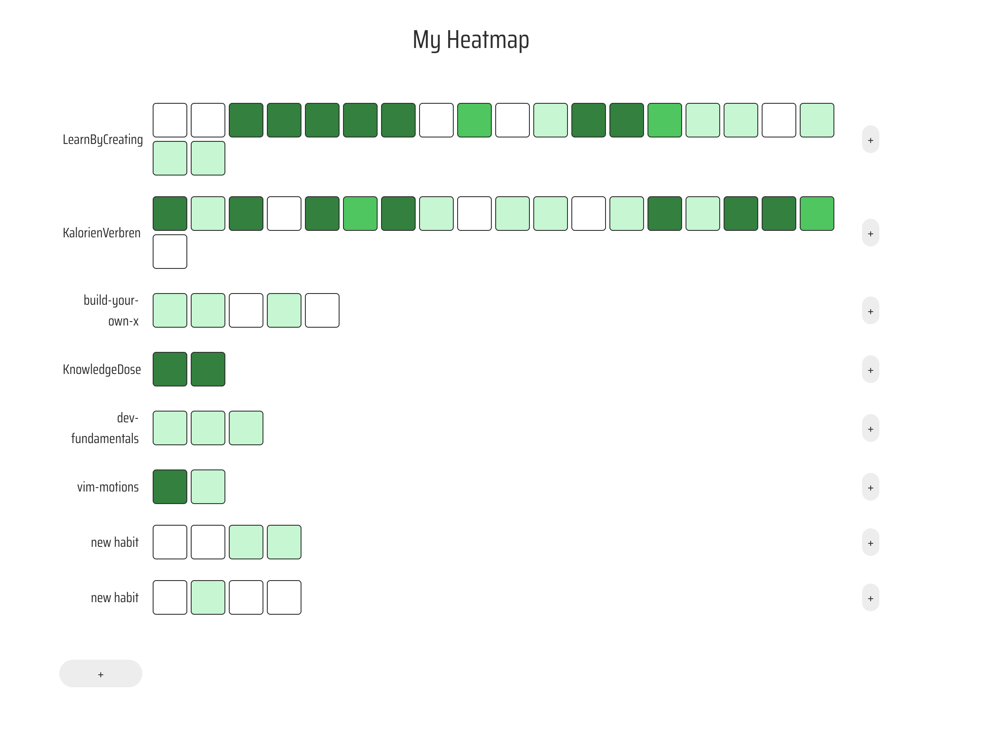

#  MyHeatmap

## Motivation

I realized that checking off a habit creates the delusion that we always have to perform on the same level when in reality it is not about going all-in all the time, but about how consistent you do something. That is why I wanted to try a heatmap similar to GitHub's contribution grid for tracking my desired habits and goals.

## How To Use

Currently, GitHub is the only sign-in option.

1. Log in with your GitHub account.
2. Click the grey plus button on the left to create a new activity.
3. Then click the grey plus button on the right of your activity to add squares.
4. Click on squares to track the intensity or quality of your effort.

Tip: Hover over a square to see when it was created, its position and its current level.

🔗 [Live App](https://heatmap-app-two.vercel.app/)

## Tech Stack

### Frontend
*   **Framework:** Next.js
*   **Language:** TypeScript
*   **Styling:**
    *   Tailwind CSS
    *   Custom CSS

### Backend & Database
*   **Backend-as-a-Service (BaaS):** Supabase

### Deployment & Hosting
*   **Platform:** Vercel

## What I Learned

- Designing with user flow in mind: Quick add, click, and see results instantly.
- Handling real-time data updates and visual state sync across components.
- Structuring scalable frontend state logic (e.g., handling per-square updates).
- How visual feedback (e.g., color intensity) can improve engagement and clarity.

## Upcoming / missing features:

- Deleting an activity
- Editing activity names
- Cleaner way of asking the user for input for a new row
- More sign-in options (Google, Email, etc.)
- A clearer way to show when squares were created
- Exporting stats or visualizations
- Mobile UI improvements
